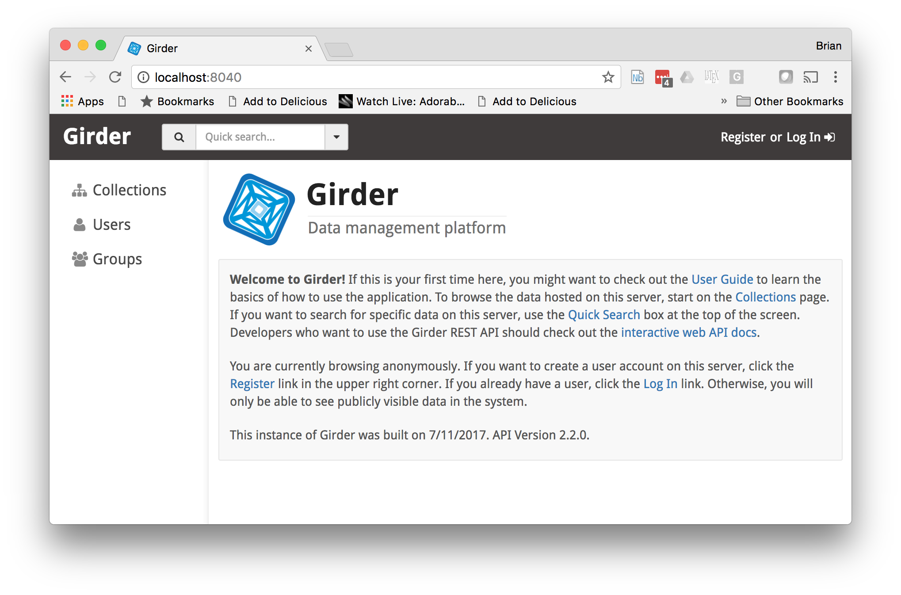

# A Brief Introduction to Using Docker

## How Did I Learn About Docker?

At a Reproducible Science workshop! (SciPy 2014 by the creators of IPython/Jupyter)

## How Did I Get Really Excited about Docker?

* I was in Berlin at a workshop and a speaker mentioned the Stanford NLP Parser.

* I think, "That could be useful," and do a Google search "stanford nlp parser docker"

* I find a web page that tells me to type this:

```bash
docker run -p 9000:9000 --name coreNLP --rm -i -t motiz88/corenlp
```

* I find another web page that tells me to type this:

```bash
wget --post-data 'The quick brown fox jumped over the lazy dog.' 'localhost:9000/?properties={"annotators":"tokenize,ssplit,pos","outputFormat":"json"}' -O -
```

#### In less than five minutes I was exploring an important software tool

## What is Docker?

Docker is an open source platform for distributing software through **containers**. Containers are a light-weight mechanism for creating isolated computing environments within an operating system. You can read Docker's own description of what Docker is [here](https://www.docker.com/what-docker) or, alternatively, this [ZDNet Article, "What is Docker and why is it so darn popular?"](http://www.zdnet.com/article/what-is-docker-and-why-is-it-so-darn-popular/)

Without getting bogged down in the technical details, Docker is popular for two primary reasons:

1. Docker makes it very easy for you to use somebody else's software, particularly if that software is complex to install and configure.

1. Docker makes it very easy for you to share your software with somebody else, thus increasing the potential for your impact in your particular scientific, engineering, or business community.

In thinking about reproducible science, Docker provides another value:

### Docker can facilitate reproducible science by creating a **version controlled** way of specifying "precisely" the computational environment in which your experiment performed.

I put precisely in quotes, because of the complexity of computing environments and the challenges of precisely describing them. We will touch on this later.


## Docker Images and containers

A Docker image is a binary file that contains all the dependencies necessary to run your software.

### Docker Images are Like Onions

A new image is defined by layering more dependencies onto a more primitive image.

### Containers are the individual compute environments created from an image.


## Running Software with Docker

### Hello, World

In your terminal, run the following command

```Bash
docker run hello-world
```

You should see something similar to the following:

```Bash
powderkeg:reproducible_science brian$ docker run hello-world
Unable to find image 'hello-world:latest' locally
latest: Pulling from library/hello-world
b04784fba78d: Pull complete
Digest: sha256:f3b3b28a45160805bb16542c9531888519430e9e6d6ffc09d72261b0d26ff74f
Status: Downloaded newer image for hello-world:latest

Hello from Docker!
This message shows that your installation appears to be working correctly.

To generate this message, Docker took the following steps:
 1. The Docker client contacted the Docker daemon.
 2. The Docker daemon pulled the "hello-world" image from the Docker Hub.
 3. The Docker daemon created a new container from that image which runs the
    executable that produces the output you are currently reading.
 4. The Docker daemon streamed that output to the Docker client, which sent it
    to your terminal.

To try something more ambitious, you can run an Ubuntu container with:
 $ docker run -it ubuntu bash

Share images, automate workflows, and more with a free Docker ID:
 https://cloud.docker.com/

For more examples and ideas, visit:
 https://docs.docker.com/engine/userguide/

powderkeg:reproducible_science brian$
```

#### What happened?

* ``docker run``

This tells docker to **run** a container.

Alternative commands include

1. ``docker build``
1. ``docker pull``

* ``docker run hello-world``

Since we told Docker we want to run a container, we have to tell it which **image** to build the container with.

Here we are are telling Docker to create the container from the **``hello-world``** image.

* Since we didn't specify a **tag**, Docker assumes we want to use the *latest* Docker image with this name. (This does not always behave as you would expect.)

The ``hello-world`` image has a default command to execute, which prints out the message we see.

### More Complex examples

The ``docker run SOMEIMAGE`` syntax can be extended by the following syntax:

```bash
docker run [OPTIONAL OPTIONS] SOMEIMAGE SOME_COMMAND
```

#### Hello world with ubuntu

We'll run a container that executes a basic Unix command.

Run the following command in the terminal:

```bash
docker run ubuntu:16.04 echo "hello, world"
```

#### Hello world with python

```bash
docker run python:3.5 python -c "print('hello, world')"
```
#### Hello world with Alpine Python

## Interactive Docker

We can create an interactive computing environment:

* ``-i``: Interactive
* ``-t``: Start a terminal connection
* ``-it``: This combines the two

```bash
docker run -it python:3.5-alpine python
```

This should bring up a Python shell that we can interact with:

```bash
powderkeg:reproducible_science brian$ docker run -it python:3.5-alpine python
Python 3.5.3 (default, Jun 28 2017, 22:06:39) 
[GCC 5.3.0] on linux
Type "help", "copyright", "credits" or "license" for more information.
>>> print(2*3*4*5)
120
>>> 
```
When you exit the Python shell with CTRL-D, the container exits.

## Viewing our Images

To view the images that now exist on your computer, execute the following command:

```bash
docker images
```

You should see a list similar but smaller to the following:

```bash
powderkeg:reproducible_science brian$ docker images
REPOSITORY                           TAG                 IMAGE ID            CREATED             SIZE
chapmanbe/resonant_ct_segmentation   latest              73c2be1fb1ff        3 days ago          1.31 GB
test_build                           latest              31e05604d93e        5 days ago          1.31 GB
<none>                               <none>              baa5b055a881        5 days ago          188 MB
<none>                               <none>              add0514dbb95        5 days ago          1.62 GB
girder/girder                        latest              ba5be9427023        6 days ago          1.46 GB
python                               3.5                 0a5c3ea81b62        9 days ago          684 MB
python                               3.4.6               ada45a0b8d42        9 days ago          680 MB
docker                               latest              192e3edb771f        2 weeks ago         97 MB
python                               3.5-alpine          235019b3e981        2 weeks ago         88.6 MB
postgres                             latest              f8d91fbcfa35        2 weeks ago         269 MB
2017_notebook                        latest              9f5b1e1b585d        3 weeks ago         8.75 GB
2017_myssh                           latest              ce515af29135        3 weeks ago         12.2 MB
2017_sshserver                       latest              ce515af29135        3 weeks ago         12.2 MB
2017_mynginx                         latest              3a38db471fcc        3 weeks ago         21.6 MB
2017_remotedata                      latest              3a38db471fcc        3 weeks ago         21.6 MB
mysql                                latest              44a8e1a5c0b2        3 weeks ago         407 MB
toolshed/requirements                latest              9f184f96efab        3 weeks ago         609 MB
ubuntu                               16.04               d355ed3537e9        3 weeks ago         119 MB
ubuntu                               14.04               4a2820e686c4        3 weeks ago         188 MB
orientdb                             latest              5da77630a9bf        4 weeks ago         149 MB
nginx                                alpine              33aa78cbda15        4 weeks ago         15.5 MB
hello-world                          latest              1815c82652c0        4 weeks ago         1.84 kB
solr                                 latest              99cb7b2a536b        5 weeks ago         518 MB
sickp/alpine-sshd                    latest              37d47e7dd0ef        6 weeks ago         7.79 MB
jupyter/datascience-notebook         11be019e4079        1c9be5e6bb85        7 weeks ago         6.84 GB
atmoz/sftp                           latest              b00345b201f6        7 weeks ago         144 MB
mongo                                latest              0dffc7177b06        6 months ago        402 MB
quay.io/bgruening/galaxy             compose             22e4ba7ca94c        12 months ago       1.55 GB
motiz88/corenlp                      latest              3d3d6ec54eb2        16 months ago       918 MB
```

#### What stands out to you?

* Docker has traditionally built Images around Debian/Ubuntu Linux.
* Alpine Linux creates much smaller containers.

## Defining our own images

We define our own images with a []**Dockerfile.**](https://docs.docker.com/engine/userguide/eng-image/dockerfile_best-practices/)

Dockerfiles have a lot of options and we will touch on only very simple Dockerfiles.

### Edge Detector

In the repository is a python script ``edge_detector.py`` and a ``Dockerfile``.

``edge_detector.py`` uses [scikit-image]() to create an edge image with a [Sobel filter]().

You can run this against the included image ``chest.jpg``. to find out how to run it, you can type:

```bash
python edge_detector.py --help
```

You might have gotten an error, since scikit-image might not be installed.

If needed, you can install scikit-image with the following command:

```bash
pip install scikit-image
```

**Note:** pip should know the dependencies that scikit-image has and install those also.

Our Dockerfile is very simple. We start with a python:3.5 image, install scikit-image, and then add our script.

We can build an image from the Dockerfile with the following command:

```bash
docker build -t chapmanbe/edger .
```

substituting for "chapmanbe" some string that identifies you.

This command tells docker to build an image that will be tagged with the name "chapmanbe/edger" and to build it with the Dockerfile contained in the current (``.``) directory.

We can now run a container with this image:

```bash

docker run -it chapmanbe/edger  bash
```

The program complains that we haven't provided required arguments.

#### Explore what happens if you change ``ENTRYPOINT`` TO ``CMD``

There are no images in the container for us to process. We can **map/mount** a directory on our host computer to a directory in the container with the ``-v`` option:

```bash
docker run -v DIRECTORY_ON_HOST:DIRECTORY_IN_CONTAINER
```
```bash
docker run -it -v $PWD:/data chapmanbe/edger bash
```

This will connect you to the container with a bash shell. Look at what is in ``/data``.

#### Change ``CMD`` back to ``ENTRYPOINT`` and Rebuild

We can now process an image with our container:

```bash
docker run -it -v $PWD:/data chapmanbe/edger --input /data/chest.jpg --output /data/chest_edge.jpg
```
### Clean up

* List all the containers we've created

```bash
docker ps -a  
```
* List the last ``n`` created containers:

```bash
powderkeg:reproducible_science brian$ docker ps -a -n 20
CONTAINER ID        IMAGE               COMMAND                  CREATED             STATUS                    PORTS               NAMES
013a3059cdba        chapmanbe/edger     "python /edge_dete..."   11 hours ago        Exited (0) 11 hours ago                       pedantic_gates
55819aad8b03        chapmanbe/edger     "python /edge_dete..."   11 hours ago        Exited (0) 11 hours ago                       goofy_wozniak
593f2d3056f9        ce275b773eec        "--input /data/che..."   11 hours ago        Created                                       kind_hopper
7f52afd8e5c7        ce275b773eec        "bash"                   11 hours ago        Exited (0) 11 hours ago                       adoring_galileo
68bcf2da1875        ce275b773eec        "python /edge_dete..."   11 hours ago        Exited (2) 11 hours ago                       youthful_mahavira
e9d582b8891b        ce275b773eec        "python /edge_dete..."   11 hours ago        Exited (2) 11 hours ago                       hardcore_pasteur
d0cdedded91e        ce275b773eec        "bash"                   11 hours ago        Exited (0) 11 hours ago                       pensive_jennings
ecd8c2c98853        chapmanbe/edger     "python /edge_dete..."   11 hours ago        Exited (2) 11 hours ago                       romantic_snyder
a089c62a2bdf        235019b3e981        "/bin/sh -c 'pip i..."   11 hours ago        Exited (1) 11 hours ago                       angry_stallman
1dfa6568ff6f        hello-world         "whoami"                 15 hours ago        Created                                       serene_bohr
f8e705e1cef0        hello-world         "ls"                     15 hours ago        Created                                       dreamy_stallman
2dc6b8dbb7ff        hello-world         "sh"                     15 hours ago        Created                                       nostalgic_mcclintock
ed685951f77f        hello-world         "pwd"                    15 hours ago        Created                                       stupefied_jones
08ec9a70d8f6        hello-world         "echo 'hello ,world'"    15 hours ago        Created                                       laughing_northcutt
f2430613157e        python:3.5-alpine   "python"                 15 hours ago        Exited (0) 15 hours ago                       festive_jennings
01f14a19ea6a        python:3.5-alpine   "python"                 15 hours ago        Exited (0) 15 hours ago                       naughty_feynman
c5261c6da521        python:3.5-alpine   "python -c 'print(..."   15 hours ago        Exited (0) 15 hours ago                       tender_thompson
08572049dd0b        ubuntu:16.04        "echo 'hello, world'"    15 hours ago        Exited (0) 15 hours ago                       competent_heyrovsky
e618b2e01cfe        ubuntu:14.04        "echo 'hello, world'"    15 hours ago        Exited (0) 15 hours ago                       wizardly_knuth
ff109e0a2bd8        python:3.5          "python -c 'print(..."   15 hours ago        Exited (0) 15 hours ago                       elegant_liskov
```

* Remove containers

```bash
docker rm ContainersID_OR_CONTAINER_NAME
```

* Use the ``--rm`` option when running to avoid unwanted persistent containers.

[Here](https://linuxconfig.org/remove-all-containners-based-on-docker-image-name) are some instructions for deleting containers based on the image name.

```bash
docker ps -a | awk '{ print $1,$2 }' | grep hello-world | awk '{print $1}' | xargs -I {} docker rm {}
```

## Improving Our Dockerfile

From a reproducible science perspective, how could we improve our Dockerfile? While we have provided a specific Python Docker image, we have not specified which version of scikit-image we used.

* Use ``pip freeze`` to determine the versions of the Python packages we are using.

```Docker
# Indicate what base image we want to build on top of
FROM python:3.5

# Install the extra python libraries we'll be using
RUN pip install scikit-image==0.12.3 

# Copy our algorithm script into the image
COPY edge_detection.py /edge_detection.py

# Make our script the executable that will be run via "docker run"
ENTRYPOINT ["python", "/edge_detection.py"]
```

* Examine the Dockerfiles used to define our [jupyterhub environment](https://github.com/UUDeCART/decart_infrastructure/blob/master/2017/jupyter/Dockerfile)
* How should this be improved?

## Now I've got a Dockerfile, So What?

#### We have a small, plain-text file that describes an entire compute environment

* Version control the file
  * Connect specific commit to specific paper (version, revision, etc.)
* Share
  * e-mail
  * GitHub
  * BitBucket

## Using Docker Hub

### Connect GitHub with Docker Hub
[Example from Resonant Course](https://github.com/UUDeCART/resonant_course/blob/master/instructions/Part3.md)

### Build, Commit, Push

* [Docker documentation for ``commit``](https://docs.docker.com/engine/reference/commandline/commit/)
* [Docker documentation for push](https://docs.docker.com/docker-cloud/builds/push-images/)

## docker-compose

docker-compose is a tool that facilitates creating Docker containers, particularly if we have complex options or a network of dependent containers. There is an example docker-compose.yml file for bringing up a [Girder](https://girder.readthedocs.io/en/latest/)/[MongoDB](https://www.mongodb.com/) pair. Even if you have a simple application, docker-compose makes working with Docker much easier.

* ``docker-compose.yml``: A [YAML](http://www.yaml.org/about.html) file describing how Docker should be run

```Docker
version: '2'
services:
  girder-dev:
    image: girder/girder:latest
    ports:
      - "8040:8080"
    entrypoint:
      - python
      - -m
      - girder
      - -d
      - mongodb://pheno-mongo-dev:27017/girder
  pheno-mongo-dev:
    image: mongo:latest
    volumes:
      - /Users/brian/GirderDataTest/MongoDB:/export
```

* We can point to local Dockerfiles if needed
* Common commands:
    * docker-compose up
    * docker-compose build
    * docker-compose stop

```bash
docker-compose up -d
```

This brings up our MongoDB container and Girder container. It creates names for the container based on the services defined in the docker-compose.yml file and the current directory name.

* The ``-d`` option detaches the processes from the terminal (try it without ``-d``)

```bash
powderkeg:reproducible_science brian$ docker-compose ps
                Name                               Command               State           Ports          
-------------------------------------------------------------------------------------------------------
reproduciblescience_girder-dev_1        python -m girder -d mongod ...   Up      0.0.0.0:8040->8080/tcp 
reproduciblescience_pheno-mongo-dev_1   /entrypoint.sh mongod            Up      27017/tcp              
```

This tells us that the girder container has a process on port 8040 of our computer. If we open a web browser to localhost:8040 we will see the Girder process:




```bash
powderkeg:reproducible_science brian$ docker-compose stop
Stopping reproduciblescience_girder-dev_1 ... done
Stopping reproduciblescience_pheno-mongo-dev_1 ... done
powderkeg:reproducible_science brian$
```
